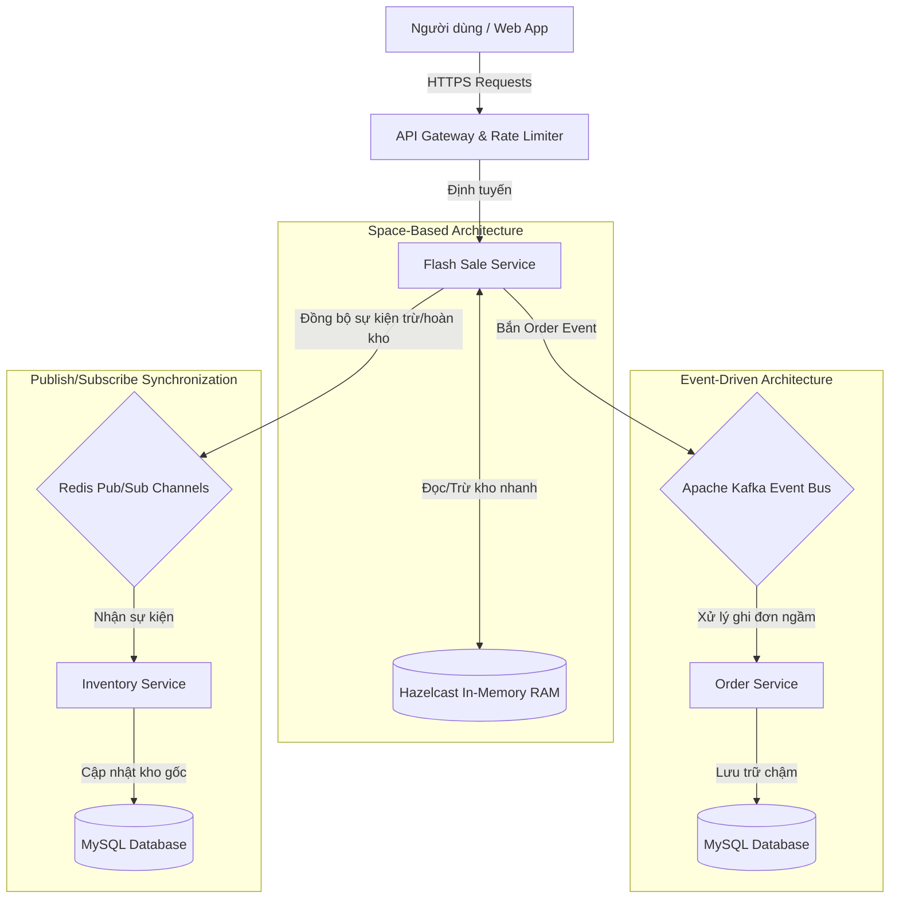
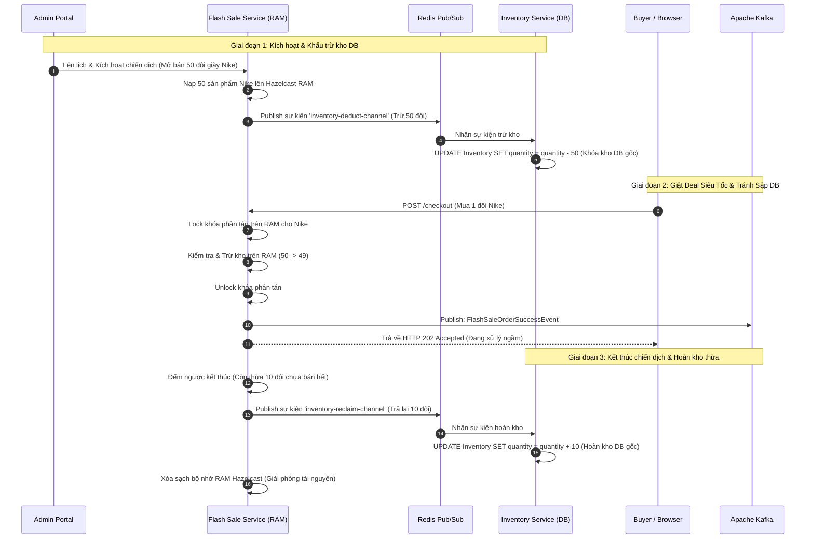

# ⚡ Kiến Trúc Hệ Thống Giật Deal Siêu Tốc (Flash Sale Architecture)

Tài liệu này mô tả chi tiết giải pháp kiến trúc cao cấp được thiết kế riêng cho module **Flash Sale** trong hệ thống E-commerce Microservices. Giải pháp này kết hợp các mô hình kiến trúc hiện đại để đảm bảo hệ thống có thể chịu tải cực lớn (high concurrency), duy trì tính nhất quán của dữ liệu kho và phản hồi nhanh chóng cho người dùng.

---

## 🎯 1. TẠI SAO LẠI CHỌN KIẾN TRÚC NÀY CHO DỰ ÁN?

Trong một đợt Flash Sale thực tế, thách thức lớn nhất không nằm ở giao diện người dùng mà ở **khả năng chịu đựng và xử lý của hệ thống Backend dưới tải cực cao đột biến (Traffic Spikes)**. Dưới đây là các lý do nhóm chúng em lựa chọn giải pháp kiến trúc phân tán này:

### 1.1. Giải quyết bài toán Nghẽn Cổ Chai Database truyền thống (Database Bottleneck)
*   **Vấn đề:** Nếu sử dụng kiến trúc Monolith hoặc Microservices thông thường chọc thẳng xuống Database (SQL), khi hàng chục nghìn người cùng nhấn nút mua tại một giây, hệ thống sẽ thực thi hàng loạt câu lệnh `UPDATE` kèm cơ chế khóa dòng (`Row-Locking`) để tránh bán quá mức. Điều này khiến Database bị quá tải, treo kết nối (Connection Timeout) và dẫn đến sập toàn bộ hệ thống Web.
*   **Giải pháp kiến trúc chọn:** Nhóm sử dụng **Space-Based Architecture** bốc toàn bộ dữ liệu kho của sản phẩm nạp sẵn lên **RAM Hazelcast**. RAM vật lý xử lý giao dịch nhanh gấp hàng trăm lần ổ đĩa cứng, hoàn toàn triệt tiêu hiện tượng nghẽn luồng tại tầng Database.

### 1.2. Khắc phục vấn đề Âm Kho / Bán Lố (Overselling)
*   **Vấn đề:** Dưới lượng request khổng lồ cùng tranh mua một đôi giày (ví dụ chỉ có 10 đôi nhưng 1000 người mua cùng lúc), nếu không có cơ chế kiểm soát đồng thì cực kỳ dễ xảy ra tình trạng "bán lố" (bán vượt quá số lượng tồn kho thực tế).
*   **Giải pháp kiến trúc chọn:** Hazelcast hỗ trợ cơ chế **Distributed Lock (Khóa phân tán)** trên từng Product ID. Hệ thống khóa, kiểm tra số lượng và trừ trực tiếp trên RAM một cách tuần tự (atomic) cho từng người dùng, đảm bảo tính nhất quán tuyệt đối của kho hàng ảo.

### 1.3. Bảo vệ hệ thống thông qua Hàng đợi Asynchronous (Traffic Shaving)
*   **Vấn đề:** Ghi đơn hàng mới vào DB đòi hỏi nhiều thao tác nặng (ghi bảng Order, OrderItem, tạo hóa đơn...). Nếu ghi đồng bộ, hệ thống sẽ sập lập tức dưới áp lực tải lớn.
*   **Giải pháp kiến trúc chọn:** **Event-Driven Architecture với Apache Kafka**. Khi người dùng mua thành công trên RAM, hệ thống chỉ sinh ra sự kiện đặt hàng gửi vào Kafka rồi trả về phản hồi lập tức cho khách hàng. Các service phía sau sẽ đọc hàng đợi Kafka và ghi dữ liệu xuống DB từ từ dưới dạng bất đồng bộ $\rightarrow$ San phẳng đỉnh tải nhọn thành một đường tải thẳng nằm ngang an toàn cho hệ thống.

---

## 🏗️ 2. Các Trụ Cột Kiến Trúc Chính


Hệ thống Flash Sale được xây dựng dựa trên 4 trụ cột công nghệ cốt lõi:



### 1.1. Space-Based Architecture (Kiến trúc dựa trên bộ nhớ RAM)
*   **Hazelcast In-Memory Data Grid (IMDG):** Đóng vai trò là phân vùng nhớ phân tán siêu tốc.
*   **Cơ chế Pre-warm (Nạp nóng):** Trước khi đợt mở bán diễn ra, toàn bộ dữ liệu tồn kho được bốc từ SQL Database và nạp sẵn lên RAM. Mọi giao dịch tranh mua (race condition) được giải quyết và trừ trực tiếp trên RAM, tránh hoàn toàn hiện tượng nghẽn khóa dòng (Row-locking) ở tầng Database truyền thống.

### 1.2. CQRS (Command Query Responsibility Segregation)
*   **Query Side (Luồng Đọc - `/query/stock/{id}`):** Khách hàng liên tục F5 để xem tồn kho real-time. Hệ thống đọc trực tiếp từ **Hazelcast RAM** với tốc độ cực nhanh (micro-seconds) thay vì chọc xuống SQL Database.
*   **Command Side (Luồng Ghi/Mua - `/checkout`):** Khi người dùng đặt mua, lệnh được xử lý khóa phân tán (`Distributed Lock`) và trừ tồn kho ảo ngay trên RAM, sau đó trả về trạng thái `PENDING (HTTP 202 Accepted)` lập tức mà không bắt người dùng chờ ghi DB.

### 1.3. Event-Driven Architecture (EDA) & Traffic Shaving (Cắt ngọn băng thông)
*   **Apache Kafka:** Khi đơn hàng Flash Sale được trừ kho thành công trên RAM, một sự kiện `FlashSaleOrderSuccessEvent` được gửi vào topic `flash-sale-orders`.
*   Các dịch vụ lưu trữ đơn hàng sẽ tiêu thụ (consume) hàng đợi này một cách bất đồng bộ để ghi nhận đơn hàng và cập nhật database từ từ $\rightarrow$ **Giúp hệ thống không bao giờ bị sập DB kể cả khi lượng truy cập tăng vọt hàng trăm lần.**

### 1.4. Publisher-Subscriber Pattern (Pub/Sub) qua Redis
*   Sử dụng để đồng bộ hóa tồn kho thời gian thực giữa hai dịch vụ cô lập: `flashsale-service` và `inventory-service`.
*   Tự động trừ kho gốc dưới DB khi chiến dịch bắt đầu (`ACTIVE`) và tự động cộng hoàn lại hàng thừa vào DB khi chiến dịch kết thúc (`ENDED`).

---

## 📡 2. Luồng Hoạt Động Chi Tiết (Sequence Diagram)

Sơ đồ tuần tự dưới đây mô tả chính xác cách hệ thống xử lý giao dịch mua hàng siêu tốc và đồng bộ kho gốc:



---

## 📈 3. Lợi Ích Của Giải Pháp Kiến Trúc

| Tiêu chí | Giải pháp thông thường (Chỉ dùng SQL DB) | Giải pháp Kiến trúc Phân tán hiện tại |
| :--- | :--- | :--- |
| **Khả năng chịu tải (Concurrency)** | Kém, dễ nghẽn mạng do khóa bảng dữ liệu | Vô hạn (Scale ngang cực kỳ dễ dàng) |
| **Thời gian phản hồi (Latency)** | Chậm (500ms - 2000ms do đĩa cứng và nghẽn) | Siêu tốc (< 10ms nhờ bộ nhớ RAM vật lý) |
| **Tính toàn vẹn dữ liệu** | Dễ bị Overselling (Bán lố) khi nhiều luồng | Tuyệt đối an toàn nhờ Hazelcast Distributed Lock |
| **Resilience (Khả năng chịu lỗi)** | DB sập sẽ kéo sập toàn bộ hệ thống | Tách biệt hoàn toàn, lỗi DB không làm gián đoạn việc mua |

---

## 🧑‍💻 4. Minh Họa Code Triển Khai Thực Tế

### Lắng nghe sự kiện đồng bộ kho tại `inventory-service` (`FlashSaleStockListener.java`):
```java
@Override
@Transactional
public void onMessage(Message message, byte[] pattern) {
    String channel = new String(message.getChannel());
    String body = new String(message.getBody());
    
    // Parse sự kiện từ Redis Pub/Sub...
    if ("inventory-deduct-channel".equals(channel)) {
        // Tự động trừ kho DB gốc khi Flash Sale bắt đầu để tránh bán đè
        inventory.setQuantity(inventory.getQuantity() - deductQty);
        inventoryRepository.save(inventory);
    } else if ("inventory-reclaim-channel".equals(channel)) {
        // Tự động hoàn lại kho thừa khi Flash Sale kết thúc để không thất thoát hàng
        inventory.setQuantity(inventory.getQuantity() + reclaimQty);
        inventoryRepository.save(inventory);
    }
}
```
