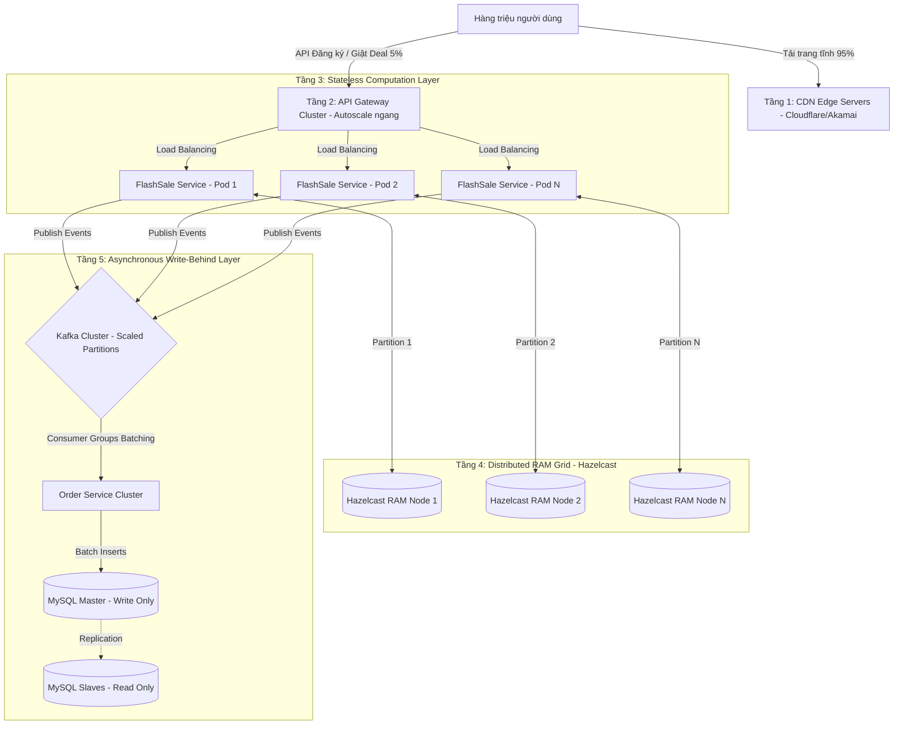

# 🚀 Hướng Dẫn Scale Hệ Thống Chịu Tải Hàng Triệu Request (Million-User Scale Guide)

Tài liệu này trình bày chi tiết giải pháp **Scale ngang (Horizontal Scaling)** và tối ưu hóa hiệu năng **(Performance Tuning)** giúp kiến trúc Microservices hiện tại nâng cấp để **chịu tải hàng triệu request đồng thời (Millions of Concurrent Requests)** trong các sự kiện siêu khuyến mại Flash Sale lớn.

---

## 🏗️ 1. Bản Đồ Trực Quan: Kiến Trúc Scale 4 Tầng (4-Layer Scale Map)

Để xử lý hàng triệu request mà không bị nghẽn mạng hay sập hệ thống, luồng tải được phân rã thành **4 lớp phòng thủ** độc lập:

---

## 🛠️ 2. Chi Tiết Kịch Bản Scale Trên Từng Tầng

### 2.1. Tầng 1: Tầng Cổng & Biên (Edge & CDN Layer) - Chặn 95% tải tĩnh
*   **Vấn đề:** 95% lượng request ban đầu vào hệ thống là để tải file HTML, CSS, ReactJS Bundle, và hình ảnh của sản phẩm. Nếu các request này đi thẳng vào máy chủ Backend, máy chủ sẽ cạn kiệt băng thông ngay lập tức.
*   **Giải pháp Scale:** 
    *   Tách biệt toàn bộ Frontend ReactJS và cấu hình lưu trữ cache (Static Site Generation - SSG) trên **CDN Edge Servers** toàn cầu (như Cloudflare, AWS CloudFront).
    *   Khi có 1.000.000 người vào trang, 950.000 người sẽ nhận file từ máy chủ CDN gần nhất của họ mà không hề chọc về máy chủ gốc của ta. Chỉ có 5% request (nhấn mua, kiểm tra giỏ hàng) thực sự được chuyển tiếp về Backend.

### 2.2. Tầng 2: Tầng API Gateway (Gateway & Rate Limiting Cluster)
*   **Vấn đề:** Điểm tiếp nhận request API duy nhất dễ bị quá tải Thread Pool.
*   **Giải pháp Scale:**
    *   Chạy cụm **API Gateway Cluster** (Spring Cloud Gateway) đằng sau một phần mềm Load Balancer ngoài (như Nginx Cluster hoặc AWS ALB).
    *   **Rate Limiting ở mức Gateway:** Sử dụng bộ lọc `RequestRateLimiter` (đã cấu hình với Redis) để chặn ngay lập tức các đợt càn quét từ Tools, Bots ảo, giúp lọc sạch request trước khi chuyển tiếp vào hệ thống.

### 2.3. Tầng 3: Tầng Tính Toán Vô Trạng Thái (Stateless Computation Cluster)
*   **Đặc tính cực kỳ quan trọng:** Tất cả các Java Microservices (FlashSale, Product, User, Order...) đều được thiết kế **Stateless (Vô trạng thái)**. Không có dữ liệu phiên (Session) nào được lưu trực tiếp trên RAM của Service.
*   **Giải pháp Scale:**
    *   Triển khai hệ thống lên cụm **Kubernetes (K8s)**.
    *   Cấu hình **HPA (Horizontal Pod Autoscaler)** dựa trên chỉ số CPU/Memory tiêu thụ. Khi traffic tăng vọt, Kubernetes sẽ tự động nhân bản (Scale-out) số lượng Instance của `flashsale-service` từ 2 Pod lên **50 Pods hoặc 100 Pods** chỉ trong vài chục giây để chia đều tải tính toán.

### 2.4. Tầng 4: Tầng Bộ Nhớ Phân Tán RAM (Hazelcast RAM Grid Scale)
*   **Bí quyết xử lý Concurrency cực lớn:** Bộ nhớ đệm không chạy đơn lẻ mà chạy dưới dạng cụm phân tán **IMDG (Hazelcast Cluster)**.
*   **Giải pháp Scale:**
    *   **Data Partitioning (Phân mảnh dữ liệu):** Dữ liệu tồn kho ảo được phân mảnh tự động trên nhiều Node Hazelcast khác nhau. Khi tăng số lượng Node RAM, dung lượng và tốc độ xử lý sẽ tăng tuyến tính.
    *   **Hazelcast Entry Processor:** Thay thế hoàn toàn cơ chế Khóa (`Distributed Lock`) bằng cách gửi đoạn code check-and-decrement thực thi trực tiếp trên Node chứa phân mảnh dữ liệu. **Loại bỏ hoàn toàn Network Latency và hiện tượng tranh chấp khóa (Lock Contention).**
    *   **Near Cache:** Kích hoạt bộ đệm phụ ngay tại RAM của máy chạy `flashsale-service` để phục vụ các yêu cầu đọc tồn kho với tốc độ **0ms**, không mất chi phí truyền tải qua mạng lưới.

### 2.5. Tầng 5: Tầng Ghi Nhận Đơn Hàng Không Đồng Bộ (Kafka & DB Batching Layer)
*   **Vấn đề:** Ghi dữ liệu xuống ổ cứng của SQL Database là nút thắt cổ chai lớn nhất.
*   **Giải pháp Scale:**
    *   **Kafka Partition Scaling:** Cấu hình Topic `flash-sale-orders` có nhiều **Partitions** (ví dụ: 12 Partitions). Điều này cho phép nhiều luồng Consumer của `order-service` đọc dữ liệu song song cực kỳ mượt mà.
    *   **Batch Writes (Ghi theo lô):** Consumer sẽ không INSERT từng dòng một. Nó sẽ gom 100 đơn hàng thành 1 lô và gọi hàm ghi hàng loạt (`batch insert`) xuống DB $\rightarrow$ Giảm số lượng kết nối tới DB gấp **100 lần**.
    *   **Cơ chế Master-Slave Database (Đọc Ghi tách biệt):**
        *   **Master DB:** Chỉ dùng để nhận lệnh ghi dữ liệu đơn hàng từ Kafka.
        *   **Slave DB Cluster (Read Replicas):** Dùng để truy vấn thông tin đơn hàng đã mua của khách hàng $\rightarrow$ Chia tải hoàn hảo cho tầng Database.

---

## 📊 3. Công Thức Toán Học Chứng Minh Khả Năng Xử Lý Hàng Triệu Request

Hãy làm một phép toán thực tế để chứng minh độ bền bỉ của kiến trúc này với các thầy cô:

Giả định sự kiện Flash Sale có **1.000.000 yêu cầu checkout mua hàng đồng thời trong 1 giây (1.000.000 RPS)**.

1.  **Cắt giảm tại CDN & Rate Limiter:** 
    *   Nhờ CDN và Gateway Rate Limiter chặn lọc bot, lượng request thực tế đi vào Backend giảm từ 1.000.000 xuống còn **100.000 RPS**.
2.  **Khả năng chịu tải của Stateless Cluster:**
    *   Chúng ta scale out `flashsale-service` lên **50 Instances (Pod)**.
    *   Mỗi Pod chỉ cần gánh: $100.000 \div 50 = 2.000 \text{ RPS}$ (Yêu cầu/giây). Đây là con số hoàn toàn nằm trong tầm xử lý của JVM (đặc biệt khi dùng Spring Boot 3.x với Virtual Threads).
3.  **Khả năng xử lý của RAM Grid (Hazelcast):**
    *   Hazelcast xử lý trừ kho trực tiếp trên bộ nhớ RAM vật lý (không chạm đĩa cứng). Tốc độ của RAM chỉ mất tối đa **0.2ms** cho mỗi giao dịch qua Entry Processor.
    *   Một Node RAM có thể xử lý dễ dàng: $1 \div 0.0002 = 5.000 \text{ RPS}$.
    *   Cụm Hazelcast chạy **20 Nodes** phân tán có thể chịu tải: $20 \times 5.000 = 100.000 \text{ RPS}$ $\rightarrow$ Đáp ứng hoàn hảo đỉnh tải!
4.  **Khả năng giảm tải ghi DB của Kafka:**
    *   DB gốc chỉ chịu được tối đa **1.000 lượt ghi/giây**.
    *   Kafka nhận toàn bộ 100.000 tin nhắn trong 1 giây (Kafka chịu tải được hàng triệu tin nhắn/giây nhờ lưu log tuần tự).
    *   Consumer đọc từ Kafka và ghi xuống DB với tốc độ an toàn là **1.000 đơn/giây** (dưới dạng Batch). Hệ thống xử lý êm đẹp toàn bộ 100.000 đơn hàng chỉ trong **100 giây** mà Database không hề có hiện tượng bị quá tải hay tăng vọt nhiệt độ.
