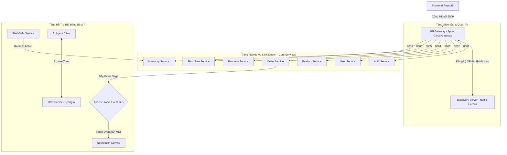

# 📦 Tổng Quan Hệ Thống Microservices & Thuyết Minh Phân Rã Dịch Vụ

Tài liệu này cung cấp cái nhìn toàn cảnh về kiến trúc **Microservices** của hệ thống thương mại điện tử, giải thích chi tiết chức năng của từng dịch vụ thành phần và đưa ra lập luận khoa học tại sao hệ thống cần được phân rã thành các dịch vụ độc lập.

---

## 🧭 1. Sơ Đồ Tổng Quan Cấu Trúc Phân Rã (Microservices Map)

Hệ thống được tổ chức thành cụm các dịch vụ chuyên biệt, chia làm 3 phân lớp chính:

---

## 🎯 2. TẠI SAO LẠI PHÂN RÃ THÀNH MICROSERVICES?

Việc chuyển đổi từ cấu trúc khối (Monolith) sang kiến trúc Microservices mang lại những giá trị cốt lõi sau cho dự án:

### 2.1. Khả năng Scale độc lập (Independent Scaling)
*   **Thực tế:** Tần suất người dùng tra cứu sản phẩm (`product-service`) và giật deal (`flashsale-service`) cao hơn gấp hàng trăm lần so với việc cập nhật hồ sơ cá nhân (`user-service`) hay thanh toán (`payment-service`).
*   **Ưu thế:** Kiến trúc Microservices cho phép chúng ta chỉ việc nhân bản (scale-out) thêm nhiều máy chủ cho `product-service` và `flashsale-service` khi lượng truy cập tăng vọt, trong khi giữ nguyên số máy chủ của `user-service` $\rightarrow$ **Tiết kiệm tối đa tài nguyên máy chủ và chi phí vận hành.**

### 2.2. Cô lập lỗi (Fault Isolation / Resilience)
*   **Thực tế:** Nếu dịch vụ gửi Email/SMS (`notification-service`) bị lỗi hoặc sập, trong hệ thống Monolith, toàn bộ ứng dụng có thể bị đứng hoặc crash.
*   **Ưu thế:** Trong hệ thống Microservices, nếu `notification-service` bị sập, khách hàng **vẫn có thể tìm sản phẩm, thêm vào giỏ hàng và đặt mua bình thường**. Sự kiện gửi email sẽ được xếp hàng trong Kafka và xử lý khi service thông báo hoạt động trở lại $\rightarrow$ **Tránh lỗi dây chuyền (Cascading Failures).**

### 2.3. Đa dạng hóa công nghệ (Technology Heterogeneity)
*   Mỗi dịch vụ có thể lựa chọn công nghệ và cơ sở dữ liệu tối ưu nhất cho nghiệp vụ của nó thay vì bị bó buộc trong một công nghệ duy nhất:
    *   `user-service` sử dụng **PostgreSQL** để quản lý thông tin người dùng có tính cấu trúc chặt chẽ.
    *   `product-service` sử dụng **Redis** để lưu cache danh mục.
    *   `flashsale-service` sử dụng **Hazelcast RAM Grid** để xử lý giật deal siêu tốc.
    *   `mcp-server` sử dụng **Spring AI** để tích hợp trí tuệ nhân tạo.

### 2.4. Phát triển và bàn giao độc lập (Independent Deployment)
*   Các nhóm lập trình có thể code, kiểm thử và deploy các service của mình một cách hoàn toàn độc lập mà không sợ làm ảnh hưởng hay xung đột với code của các nhóm khác.

---

## 🧩 3. Giải Thích Chi Tiết Chức Năng Từng Dịch Vụ (Service Registry)

### 3.1. Discovery Server (Eureka Server) - Cổng Cổng Dịch Vụ
*   **Chức năng:** Là "cuốn danh bạ điện thoại" của toàn hệ thống. Tất cả các microservices khi khởi động đều phải đăng ký địa chỉ IP và số cổng của mình tại đây.
*   **Ý nghĩa:** Giúp các dịch vụ tự động phát hiện ra nhau mà không cần cấu hình cứng (hardcode) IP của nhau, hỗ trợ đắc lực cho việc Scale-out ngang.

### 3.2. API Gateway (Spring Cloud Gateway) - Cửa Ngõ Hệ Thống
*   **Chức năng:** Là điểm tiếp nhận request duy nhất của toàn bộ Client. Gateway chịu trách nhiệm:
    *   Định tuyến request đến đúng microservice xử lý (Routing).
    *   Xác thực quyền truy cập cơ bản (Dữ liệu Header CORS).
    *   Bộ lọc **Rate Limiter** bảo mật chống spam DDoS.
    *   Hợp tác load balancing tự động thông qua Eureka (`lb://`).

### 3.3. Auth Service - Dịch vụ Xác thực
*   **Chức năng:** Quản lý tài khoản đăng nhập, đăng ký và cấp phát khóa bảo mật **JWT Token** (JSON Web Token) cho người dùng khi đăng nhập thành công.

### 3.4. User Service - Quản lý Người dùng
*   **Chức năng:** Lưu trữ thông tin cá nhân của người dùng, counter theo dõi trạng thái Online/Offline (qua Redis & WebSockets) và xử lý sinh mã OTP bảo mật.

### 3.5. Product Service - Quản lý Sản phẩm
*   **Chức năng:** Quản lý danh mục, thông tin chi tiết sản phẩm, giá bán, hình ảnh và lưu bộ đệm (caching) sản phẩm lên Redis để tối ưu hóa tốc độ tìm kiếm.

### 3.6. Order Service - Xử lý Đơn hàng (Saga Orchestrator)
*   **Chức năng:** Tiếp nhận yêu cầu mua hàng của người dùng. Đây là nhạc trưởng quản lý giao dịch phân tán sử dụng **mô hình Saga** thông qua Kafka nhằm đảm bảo tính nhất quán dữ liệu giữa luồng tạo đơn hàng, thanh toán và trừ kho.

### 3.7. Payment Service - Xử lý Thanh toán
*   **Chức năng:** Liên kết và xử lý thanh toán thực tế thông qua các cổng thanh toán (ví dụ: VNPay, COD) sử dụng mẫu thiết kế **Strategy Pattern** linh hoạt.

### 3.8. Inventory Service - Quản lý Kho hàng
*   **Chức năng:** Quản lý số lượng tồn kho vật lý của từng sản phẩm dưới Database. Lắng nghe các sự kiện trừ kho khi đặt hàng và hoàn kho từ Kafka/Redis Pub-Sub.

### 3.9. Notification Service - Gửi Thông báo
*   **Chức năng:** Lắng nghe các sự kiện đặt hàng, thanh toán thành công, gửi OTP từ Kafka để thực thi việc gửi Email/SMS thực tế cho khách hàng.

### 3.10. FlashSale Service - Giật Deal Siêu Tốc
*   **Chức năng:** Xử lý nghiệp vụ mở bán số lượng giới hạn tốc độ cao sử dụng bộ nhớ đệm **Hazelcast RAM** để gánh toàn bộ tải truy cập đồng thời khổng lồ mà không chạm vào Database.

### 3.11. MCP Server (Spring AI Integration) - Tích Hợp AI Agent
*   **Chức năng:** Đóng vai trò là máy chủ cung cấp công cụ (Model Context Protocol). Nó cung cấp các API nghiệp vụ (`@Tool` như tạo sản phẩm, xem danh mục) cho các mô hình AI Agent (như Gemini, Claude) có thể tương tác tự động và hỗ trợ khách hàng thông minh.
